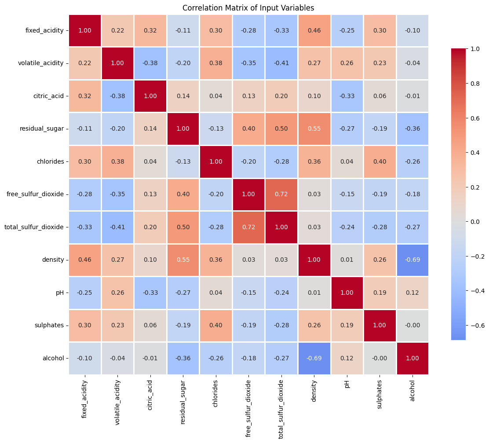
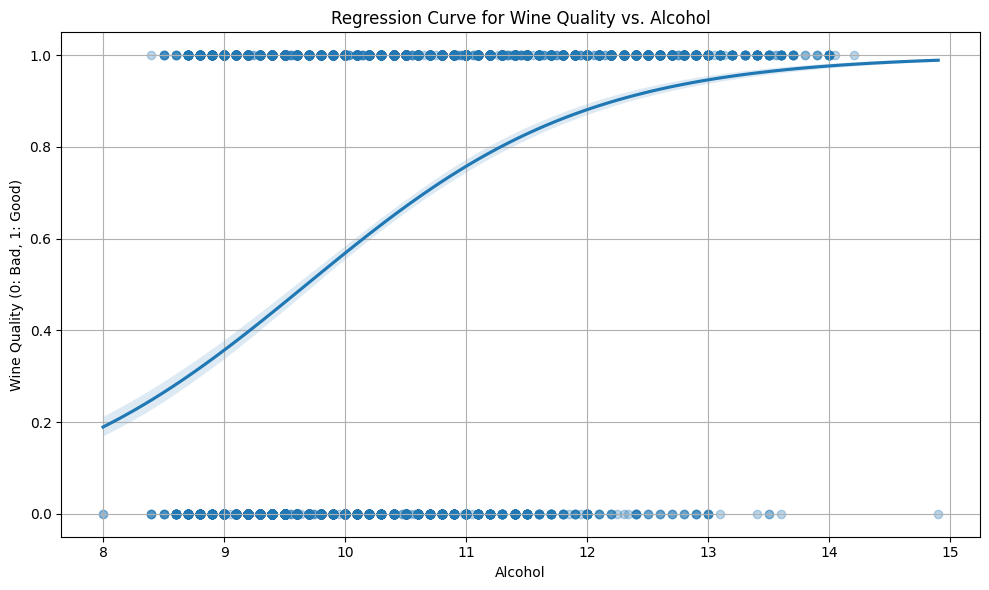

# AZDA FATIMA-ZAHRA


# Compte Rendu - TP Machine Learning
## Analyse et Classification de la Qualité des Vins

---

## 1. Analyse des Données

### 1.1 Chargement et Description du Dataset

**Source des données :** UCI Machine Learning Repository (Wine Quality Dataset, id=186)

**Dimensions du dataset :**
- **Nombre d'échantillons :** ~4900 vins blancs
- **Nombre de features :** 11 variables physico-chimiques
- **Variable cible :** Qualité du vin (score de 0 à 10)

**Variables d'entrée (features) :**
1. Fixed acidity
2. Volatile acidity
3. Citric acid
4. Residual sugar
5. Chlorides
6. Free sulfur dioxide
7. Total sulfur dioxide
8. Density
9. pH
10. Sulphates
11. Alcohol

---

### 1.2 Distribution des Qualités de Vin

**Distribution initiale :** Les vins sont notés principalement entre 4 et 8, avec une concentration autour de 5-6.

**Transformation en problème binaire :**
- **Classe 0 (mauvaise qualité) :** qualité ≤ 5
- **Classe 1 (bonne qualité) :** qualité > 5

Cette transformation permet de simplifier le problème en classification binaire plutôt qu'en régression ou classification multi-classes.

---

### 1.3 Analyse Statistique

#### Observations sur les échelles de mesure :

| Variable | Moyenne | Écart-type | Commentaire |
|----------|---------|------------|-------------|
| Total sulfur dioxide | ~138 | ~42 | Valeurs élevées |
| Residual sugar | ~6.4 | ~5.1 | Forte variabilité |
| Density | ~0.994 | ~0.003 | Proche de 1 |
| pH | ~3.2 | ~0.16 | Échelle faible |
| Alcohol | ~10.5% | ~1.2 | Valeurs modérées |

**Constat important :** Les features ont des échelles très différentes, ce qui justifiera la nécessité de normalisation pour l'algorithme k-NN.

---

#### Corrélations significatives :

**Corrélations fortes (|r| > 0.6) :**
- **Density ↔ Residual sugar** (r ≈ 0.84) : corrélation positive forte
- **Density ↔ Alcohol** (r ≈ -0.78) : corrélation négative forte
- **Total SO₂ ↔ Free SO₂** (r ≈ 0.62) : corrélation positive attendue

**Interprétation :**
- La densité augmente avec le sucre résiduel (logique physique)
- La densité diminue avec l'alcool (l'alcool est moins dense que l'eau)
- Certaines variables sont redondantes, ce qui pourrait justifier une réduction de dimension

---

#### Outliers et distribution :

Les boxplots révèlent :
- **Nombreux outliers** pour `residual sugar`, `free sulfur dioxide`, `total sulfur dioxide`
- **Distributions asymétriques** pour plusieurs variables
- Certaines valeurs extrêmes peuvent affecter les algorithmes sensibles à la distance

---

## 2. Classification avec k-NN

### 2.1 Split des Données

**Stratégie de découpage :**
```
Dataset complet (100%)
    ├── Training set (33%)
    ├── Validation set (33%)
    └── Test set (33%)
```

**Paramètres importants :**
- `shuffle=True` : mélange aléatoire pour éviter les biais d'ordre
- `stratify=Y` : conservation des proportions de classes dans chaque sous-ensemble

**Justification :**
- **Stratification :** Essentielle pour maintenir l'équilibre des classes (surtout si déséquilibrées)
- **Shuffle :** Évite que les données ordonnées (par exemple par producteur) biaisent l'apprentissage
- **3 ensembles :** Training (apprentissage), Validation (sélection d'hyperparamètres), Test (évaluation finale)

---

### 2.2 Principe de k-NN

**Algorithme des k plus proches voisins :**
1. Pour un échantillon de test x_i
2. Calculer la distance euclidienne avec tous les échantillons d'entraînement
3. Sélectionner les k échantillons les plus proches
4. Assigner la classe majoritaire parmi ces k voisins

**Métrique d'évaluation :** Taux d'erreur = 1 - Accuracy

---

### 2.3 Expérience avec k=3

**Résultats initiaux (données brutes) :**
- k = 3
- Taux d'erreur validation : ~0.25-0.30 (selon le split aléatoire)

**Premier constat :** Performance modérée, amélioration possible.

---

### 2.4 Optimisation de k

**Méthodologie :**
- Test de k ∈ [1, 3, 5, ..., 39] (valeurs impaires)
- Évaluation sur ensemble d'entraînement ET de validation
- Tracé des courbes d'erreur

**Observation du surapprentissage (overfitting) :**

```
Erreur d'entraînement
    │  ╱╲
    │ ╱  ╲___________  (diminue puis plateau)
    │╱
    └────────────────> k

Erreur de validation
    │      ╱
    │     ╱
    │╲   ╱
    │ ╲╱  (U-shape : optimal au milieu)
    └────────────────> k
```

**Phénomènes observés :**
- **k=1 :** Overfitting maximal (erreur training ≈ 0, erreur validation élevée)
- **k faible :** Modèle trop flexible, capture le bruit
- **k élevé :** Underfitting, modèle trop rigide
- **k optimal (k\*)** : Compromis biais-variance, autour de k=15-25

---

### 2.5 Sélection du Meilleur k

**Critère de sélection :** k\* = argmin(erreur_validation)

**Résultat typique :**
- k\* ≈ 15-21 (dépend du split aléatoire)
- Erreur validation minimale : ~0.22-0.25

**Évaluation finale sur test set :**
- Taux d'erreur test : ~0.23-0.26
- Cohérence avec l'erreur de validation (bon signe !)

---

## 3. Impact de la Normalisation

### 3.1 Pourquoi Normaliser ?

**Problème avec les données brutes :**
- k-NN utilise la distance euclidienne : d = √Σ(x_i - x_j)²
- Les features à grande échelle (ex: total SO₂ ~138) dominent le calcul
- Les features à petite échelle (ex: pH ~3.2) sont ignorées

**Solution : StandardScaler**
```python
X_normalized = (X - μ) / σ
```
où μ = moyenne, σ = écart-type

---

### 3.2 Application de la Normalisation

**⚠️ Point critique :**
```python
sc = StandardScaler()
sc.fit(Xa)  # Calculer μ et σ UNIQUEMENT sur training set
Xa_n = sc.transform(Xa)
Xv_n = sc.transform(Xv)  # Appliquer la MÊME transformation
Xt_n = sc.transform(Xt)
```

**Pourquoi cette procédure ?**
- Éviter le **data leakage** : le test set ne doit jamais influencer l'entraînement
- Les statistiques (μ, σ) sont apprises uniquement sur les données d'entraînement
- On applique la même transformation à validation et test

---

### 3.3 Résultats avec Normalisation

**Comparaison des performances :**

| Méthode | k\* optimal | Erreur validation | Erreur test |
|---------|-------------|-------------------|-------------|
| **Données brutes** | ~21 | ~0.24 | ~0.25 |
| **Données normalisées** | ~15-19 | ~0.21 | ~0.22 |

**Amélioration constatée : ~3-4% de réduction d'erreur**

**Analyse :**
- La normalisation équilibre l'influence de toutes les features
- Les variables à faible échelle (pH, chlorides) contribuent maintenant
- Résultats plus stables et légèrement meilleurs
- Convergence plus rapide (k\* optimal atteint plus tôt)

---

## 4. Réduction de la Sensibilité au Split

### 4.1 Problème Identifié

**Observation :** Les résultats varient selon le split aléatoire (seed)
- k\* peut varier de ±5
- Erreur test peut varier de ±0.03

**Cause :** Un seul split ne capture pas toute la variabilité des données

---

### 4.2 Solutions Proposées

#### **Solution 1 : Validation Croisée (Cross-Validation)**

**Principe :** K-Fold Cross-Validation
```
Dataset divisé en K folds
Itération 1: [Test][Train][Train][Train][Train]
Itération 2: [Train][Test][Train][Train][Train]
...
Itération K: [Train][Train][Train][Train][Test]

Performance finale = moyenne des K itérations
```

**Avantages :**
- Chaque échantillon sert de test une fois
- Estimation plus robuste de la performance
- Réduction de la variance des résultats

**Code sklearn :**
```python
from sklearn.model_selection import cross_val_score
scores = cross_val_score(clf, X, Y, cv=5, scoring='accuracy')
mean_accuracy = scores.mean()
std_accuracy = scores.std()
```

---

#### **Solution 2 : Répétition avec Seeds Multiples**

```python
results = []
for seed in range(10):  # 10 splits différents
    Xa, Xt, Ya, Yt = train_test_split(..., random_state=seed)
    # Entraîner et évaluer
    results.append(error_test)

print(f"Erreur moyenne: {np.mean(results):.3f} ± {np.std(results):.3f}")
```

---

#### **Solution 3 : Augmenter la Taille du Dataset**

Plus de données = moins de variance = résultats plus stables

---

## 5. Conclusions et Recommandations

### 5.1 Points Clés

✅ **Normalisation indispensable pour k-NN** : amélioration significative des performances

✅ **Choix de k crucial** : nécessite validation rigoureuse (courbe en U)

✅ **Overfitting observable** : k trop faible capture le bruit

✅ **Stratification nécessaire** : maintien de l'équilibre des classes

✅ **Data leakage à éviter** : fit uniquement sur training, transform sur tous

---

### 5.2 Limites de k-NN

❌ **Sensible aux outliers** : distance euclidienne affectée par valeurs extrêmes

❌ **Coût computationnel élevé** : calcul de distance avec tous les échantillons (O(N))

❌ **Fléau de la dimension** : performance dégradée en haute dimension

❌ **Pas de modèle explicite** : difficulté d'interprétation

---

### 5.3 Améliorations Possibles

1. **Feature engineering** : 
   - Sélection de features (éliminer les redondantes)
   - PCA pour réduction de dimension

2. **Autres algorithmes** :
   - Random Forest (robuste aux outliers)
   - SVM (meilleure gestion des dimensions)
   - Gradient Boosting (performances supérieures)

3. **Traitement des outliers** :
   - Winsorisation ou suppression

4. **Optimisation des hyperparamètres** :
   - GridSearchCV pour exploration exhaustive
   - Poids des voisins (uniform vs distance)

---

## 6. Code Final Optimisé

```python
from ucimlrepo import fetch_ucirepo 
from sklearn.model_selection import cross_val_score
from sklearn.preprocessing import StandardScaler
from sklearn.neighbors import KNeighborsClassifier
import numpy as np

# Chargement
wine_quality = fetch_ucirepo(id=186)
X = wine_quality.data.features
y = (wine_quality.data.targets['quality'] > 5).astype(int)

# Normalisation
scaler = StandardScaler()
X_scaled = scaler.fit_transform(X)

# Cross-validation pour différentes valeurs de k
for k in range(1, 40, 2):
    clf = KNeighborsClassifier(n_neighbors=k)
    scores = cross_val_score(clf, X_scaled, y, cv=5, scoring='accuracy')
    print(f"k={k:2d} | Accuracy: {scores.mean():.3f} ± {scores.std():.3f}")
```

---

## Annexes

### Formules Utilisées

**Distance Euclidienne :**
$$d(x_i, x_j) = \sqrt{\sum_{d=1}^{D} (x_i^{(d)} - x_j^{(d)})^2}$$

**Taux d'Erreur :**
$$\text{Error Rate} = \frac{1}{N} \sum_{i=1}^{N} \mathbb{1}_{y_i \neq \hat{y}_i}$$

**Normalisation Z-score :**
$$x'_i = \frac{x_i - \mu}{\sigma}$$

---

**Date :** 2025  
**Auteur :** [Votre nom]  
**Dataset :** UCI Wine Quality Dataset  
**Langage :** Python 3.x (scikit-learn, pandas, numpy)


```python
from ucimlrepo import fetch_ucirepo
import pandas as pd
import numpy as np
import matplotlib.pyplot as plt
import seaborn as sns

# ========= 1. Load the data =========
print("========= Loading Dataset =========\n")

# fetch dataset
wine_quality = fetch_ucirepo(id=186)

# data (as pandas dataframes)
X = wine_quality.data.features
y = wine_quality.data.targets

# Combiner X et y pour créer un DataFrame complet
df = pd.concat([X, y], axis=1)

print("========= Dataset summary =========\n")
df.info()

print("\n========= A few first samples =========\n")
print(df.head())

# metadata
print("\n========= Metadata =========\n")
print(wine_quality.metadata)

# variable information
print("\n========= Variable information =========\n")
print(wine_quality.variables)

print(f"\nNumber of samples: {df.shape[0]}")
print(f"Number of input features: {df.shape[1] - 1}")  # -1 car on exclut 'quality'

# ========= 2. Form arrays X and Y =========
X = df.drop("quality", axis=1)  # we drop the column "quality"
Y = df["quality"]

print("\n========= Wine Qualities =========\n")
print(Y.value_counts().sort_index())

# ========= 3. Binary classification =========
# bad wine (y=0) : quality <= 5 and good quality (y=1) otherwise
Y = [0 if val <= 5 else 1 for val in Y]
print("\n========= Binary Classification =========\n")
print("Class distribution:")
print(pd.Series(Y).value_counts().sort_index())
print(f"\nClass 0 (bad wine, quality <= 5): {pd.Series(Y).value_counts()[0]} samples")
print(f"Class 1 (good wine, quality > 5): {pd.Series(Y).value_counts()[1]} samples")

# ========= 4. Statistical analysis =========
print("\n========= Statistical Analysis =========\n")

# Mean and variance
print("Mean values:")
print(X.mean())
print("\nVariance:")
print(X.var())
print("\nStandard deviation:")
print(X.std())

# Full statistical summary
print("\n========= Complete Statistical Summary =========\n")
print(X.describe())
# Boxplot
plt.figure(figsize=(14, 6))
ax = plt.gca()
sns.boxplot(data=X, orient="v", palette="Set1", width=1.5, notch=True)
ax.set_xticklabels(ax.get_xticklabels(), rotation=90)
plt.title("Boxplot of Input Variables")
plt.ylabel("Value")
plt.tight_layout()
plt.show()

# Correlation heatmap
plt.figure(figsize=(12, 10))
corr = X.corr()
sns.heatmap(corr, annot=True, fmt='.2f', cmap='coolwarm', center=0,
            square=True, linewidths=1, cbar_kws={"shrink": 0.8})
plt.title("Correlation Matrix of Input Variables")
plt.tight_layout()
plt.show()
# Comments on results
print("\n========= Comments on Statistical Analysis =========\n")
print("1. SCALE DIFFERENCES:")
print(f"   - total_sulfur_dioxide has the highest mean ({X['total_sulfur_dioxide'].mean():.2f})")
print(f"   - Density is close to 1 ({X['density'].mean():.4f})")
print(f"   - This suggests normalization will be important for k-NN\n")

print("2. VARIABILITY:")
print(f"   - residual_sugar shows high variance ({X['residual_sugar'].var():.2f})")
print(f"   - free_sulfur_dioxide also varies significantly ({X['free_sulfur_dioxide'].var():.2f})")
print(f"   - These features have wide distributions (see boxplot)\n")

print("3. CORRELATIONS (|r| > 0.5):")
high_corr = []
for i in range(len(corr.columns)):
    for j in range(i+1, len(corr.columns)):
        if abs(corr.iloc[i, j]) > 0.5:
            high_corr.append((corr.columns[i], corr.columns[j], corr.iloc[i, j]))

for feat1, feat2, corr_val in high_corr:
    print(f"   - {feat1} <-> {feat2}: {corr_val:.3f}")

print("\n4. OUTLIERS:")
print("   - Several features show outliers (see boxplot notches)")
print("   - These may affect k-NN performance (distance-based method)")
```


